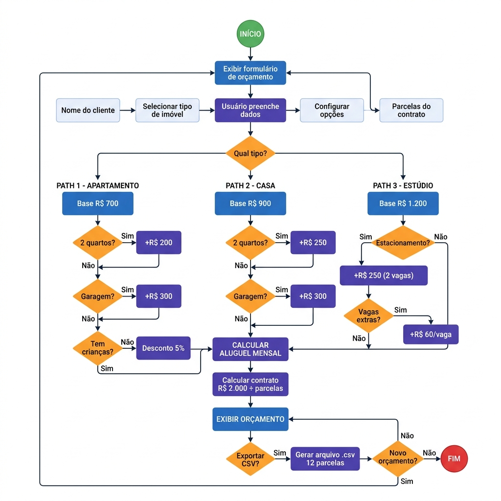
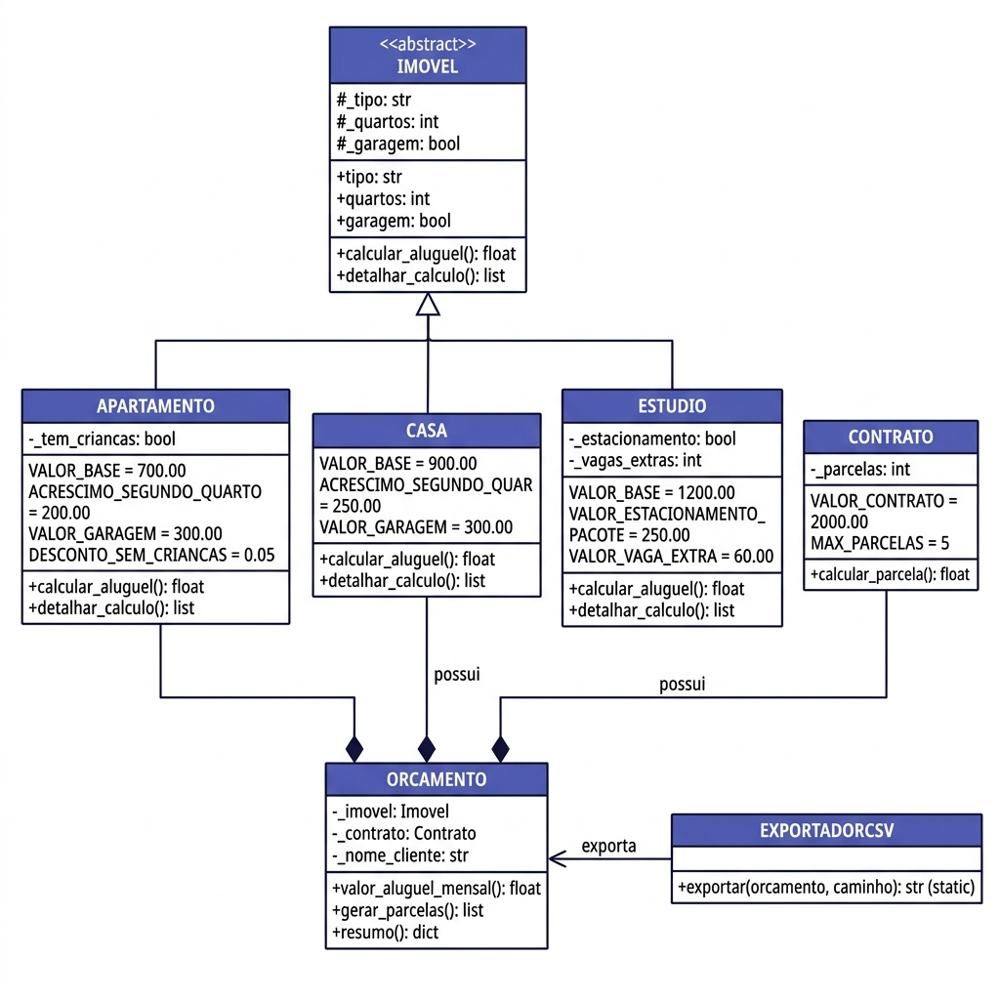

# Parte Teórica — Fluxograma e Estrutura Lógica

Disciplina: Algorithmic Thinking & Introduction to Object-Oriented Programming
Projeto: Orçamento de Aluguel — R.M Imobiliária
Aluno: [PREENCHER NOME]

---

## 1. Fluxograma da Aplicação

O fluxograma abaixo representa o fluxo principal da aplicação, desde a entrada de dados pelo usuário até a geração do orçamento e exportação em CSV.



---

## 2. Diagrama de Classes UML

A aplicação utiliza Programação Orientada a Objetos com os seguintes princípios:

- Abstração: Classe base Imovel define a interface comum
- Herança: Apartamento, Casa e Estudio herdam de Imovel
- Polimorfismo: Cada subclasse implementa calcular_aluguel() com suas próprias regras
- Encapsulamento: Atributos privados com acesso via @property



---

## 3. Pseudocódigo — Lógica Principal

## 3.1 Algoritmo de Cálculo do Aluguel

```
ALGORITMO CalcularAluguelMensal

ENTRADA: tipo_imovel, quartos, garagem, tem_criancas, estacionamento, vagas_extras

SE tipo_imovel == "Apartamento" ENTÃO
    aluguel ← 700.00
    SE quartos == 2 ENTÃO
        aluguel ← aluguel + 200.00
    FIM SE
    SE garagem == VERDADEIRO ENTÃO
        aluguel ← aluguel + 300.00
    FIM SE
    SE tem_criancas == FALSO ENTÃO
        aluguel ← aluguel × 0.95        // Desconto de 5%
    FIM SE

SENÃO SE tipo_imovel == "Casa" ENTÃO
    aluguel ← 900.00
    SE quartos == 2 ENTÃO
        aluguel ← aluguel + 250.00
    FIM SE
    SE garagem == VERDADEIRO ENTÃO
        aluguel ← aluguel + 300.00
    FIM SE

SENÃO SE tipo_imovel == "Estúdio" ENTÃO
    aluguel ← 1200.00
    SE estacionamento == VERDADEIRO ENTÃO
        aluguel ← aluguel + 250.00      // Pacote 2 vagas
        SE vagas_extras > 0 ENTÃO
            aluguel ← aluguel + (vagas_extras × 60.00)
        FIM SE
    FIM SE
FIM SE

RETORNAR aluguel
FIM ALGORITMO
```

## 3.2 Algoritmo de Geração do Orçamento

```
ALGORITMO GerarOrcamento

ENTRADA: imovel, contrato, nome_cliente

aluguel_mensal ← imovel.calcular_aluguel()
total_12_meses ← aluguel_mensal × 12
parcela_contrato ← 2000.00 ÷ contrato.parcelas

CRIAR lista_parcelas ← lista vazia
PARA mes DE 1 ATÉ 12 FAÇA
    ADICIONAR {mes, "Mês XX", aluguel_mensal} EM lista_parcelas
FIM PARA

EXIBIR aluguel_mensal, total_12_meses, parcela_contrato, lista_parcelas

FIM ALGORITMO
```

## 3.3 Algoritmo de Exportação CSV

```
ALGORITMO ExportarCSV

ENTRADA: orcamento, caminho_arquivo

ABRIR arquivo CSV em caminho_arquivo

ESCREVER cabeçalho com dados do cliente e imóvel
ESCREVER detalhamento do cálculo
ESCREVER informações do contrato
ESCREVER linha de cabeçalho da tabela: "Mês", "Descrição", "Valor"

PARA CADA parcela EM orcamento.parcelas FAÇA
    ESCREVER parcela.mes, parcela.descricao, parcela.aluguel
FIM PARA

ESCREVER total dos 12 meses
FECHAR arquivo

FIM ALGORITMO
```

---

## 4. Pensamento Algorítmico Aplicado

## 4.1 Decomposição

O problema foi decomposto em módulos independentes:
- Módulo de Imóveis → Responsável pelos tipos e cálculos de aluguel
- Módulo de Contrato → Responsável pelo contrato e parcelamento
- Módulo de Orçamento → Combina imóvel + contrato e gera as parcelas
- Módulo de Exportação → Gera o arquivo CSV

## 4.2 Reconhecimento de Padrões

Identificamos que os três tipos de imóvel compartilham uma estrutura comum (tipo, quartos, garagem, cálculo de aluguel), porém com regras específicas de cada um. Isso levou à escolha de uma hierarquia de herança com classe base abstrata.

## 4.3 Abstração

A classe Imovel abstrai os detalhes específicos de cada tipo. Quando a aplicação precisa calcular o aluguel, ela chama imovel.calcular_aluguel() sem precisar saber se é Apartamento, Casa ou Estúdio — o polimorfismo garante que o método correto seja executado.

## 4.4 Algoritmo (Passo a passo)

1. O usuário preenche o formulário na interface web
2. Os dados são enviados ao servidor Flask
3. Com base no tipo de imóvel, a classe correta é instanciada (polimorfismo)
4. O método `calcular_aluguel()` aplica as regras de negócio automaticamente
5. O `Orcamento` combina imóvel + contrato e gera as 12 parcelas
6. O resultado é exibido na tela com detalhamento completo
7. Opcionalmente, o usuário pode exportar o orçamento em CSV

---

## 5. Tecnologias Utilizadas

| Tecnologia      | Finalidade                                      |
|-----------------|------------------------------------------------ |
| Python 3.14     | Linguagem principal                             |
| Flask           | Framework web para interface e rotas             |
| HTML/CSS        | Interface do usuário (frontend)                  |
| Jinja2          | Templates dinâmicos no HTML                      |
| CSV (módulo)    | Exportação dos dados do orçamento                |
| ABC (módulo)    | Classe base abstrata (OOP)                       |
| GitHub          | Versionamento e publicação do código             |

---

## 6. Estrutura de Arquivos do Projeto

```
Trabalho/
├── app.py                    # Servidor Flask (ponto de entrada)
├── models/
│   ├── __init__.py           # Pacote de modelos
│   ├── imovel.py             # Classes: Imovel, Apartamento, Casa, Estudio
│   ├── contrato.py           # Classe: Contrato
│   └── orcamento.py          # Classes: Orcamento, ExportadorCSV
├── templates/
│   └── index.html            # Interface web (Jinja2)
├── static/
│   └── style.css             # Estilização (dark mode premium)
├── orcamento.csv             # Arquivo CSV gerado (saída)
├── REQUISITOS.md             # Documentação de requisitos
└── fluxograma_e_logica.md    # Este documento
```
